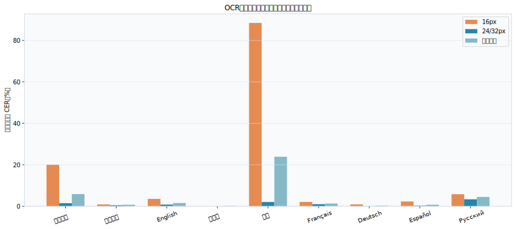
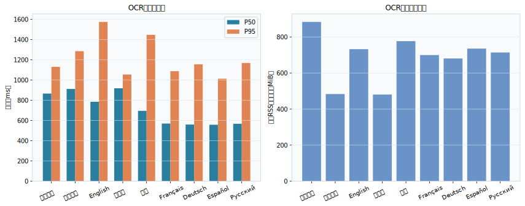
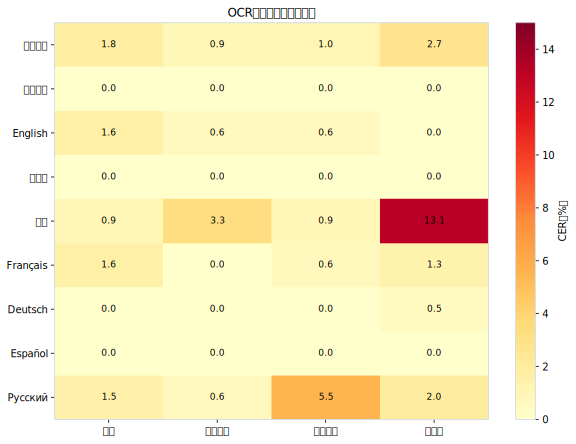
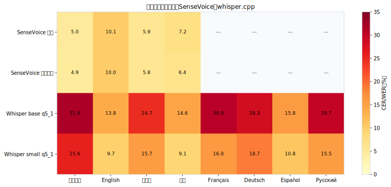
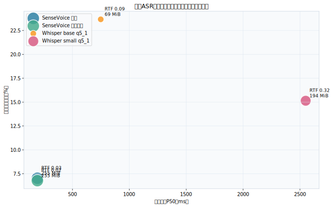
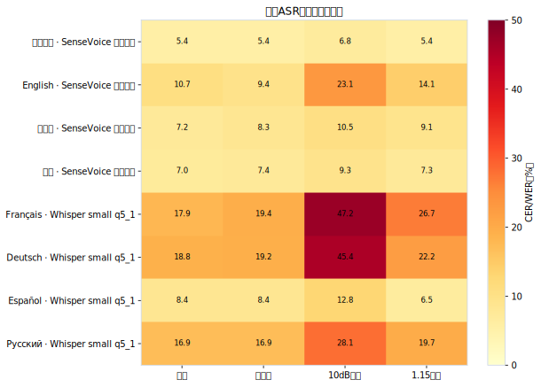
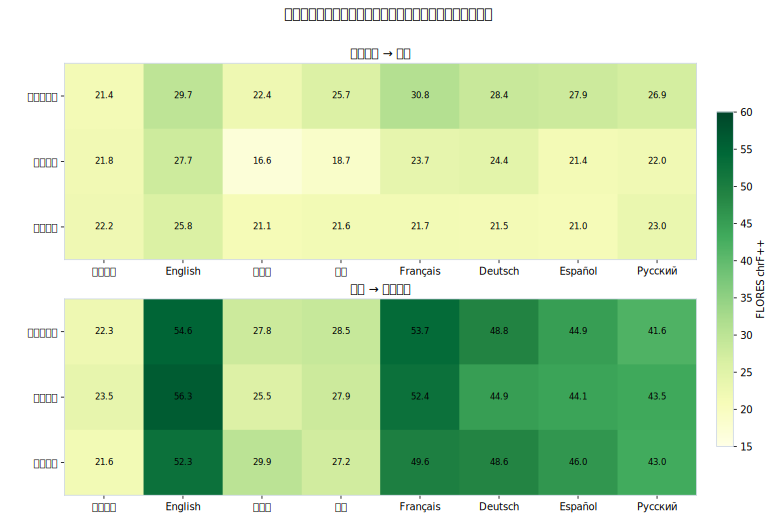
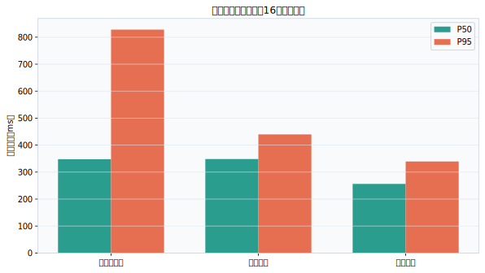
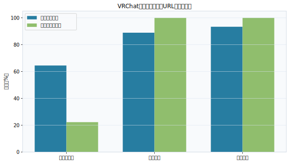
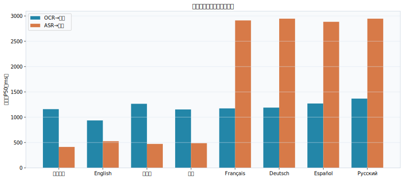

# VRCTranslate 多语言全链路质量与性能测试报告

## 1. 结论摘要

- 测试日期：2026-07-21
- 软件版本：v0.10.0
- 测试范围：九语言OCR、中文中心16个翻译方向、八种口语的本地ASR候选、OCR/ASR端到端组合。
- OCR共执行 720 个基础样本和 180 个压力样本；所有图片在内存中生成，没有保存截图。
- ASR共执行 720 个基础识别和 320 个压力识别，使用FLEURS真人音频。
- 三个付费翻译档案各完成480/480次标准请求；结果集与端到端共包含约 1610 次成功付费调用。Google免费端点连续超时后熔断。
- 当前最可靠组合：中英日韩语音继续使用SenseVoice；whisper.cpp不能替换SenseVoice。西班牙语可把Whisper small作为实验性组件，法德俄仍不适合作为默认实时字幕。
- OCR最突出的问题是16px中文/韩文；24/32px时九语言CER均降到3.4%以内。
- VRChat领域测试发现URL和标识符保护不足，必须增加独立于术语库的通用不变量保护。

## 2. 测试环境与边界

| 项目 | 值 |
|---|---|
| CPU | AMD Ryzen 7 7840H w/ Radeon 780M Graphics |
| 物理/逻辑核心 | 8 / 16 |
| 内存 | 15.2 GiB |
| 操作系统 | Windows-10-10.0.26200-SP0 |
| Python | 3.11.4 |
| OCR线程 | ONNX Runtime 2个intra-op线程 |
| ASR线程 | 4线程、CPU模式 |

本报告不是所有72个语言对的穷举，而是已批准的产品级矩阵：每种语言与简体中文双向。翻译质量使用FLORES-200的30条对齐句；chrF、BLEU和TER只适合同一方向、同一参考集内比较。合法改写、专名音译差异会得到较低自动分，因此低chrF样本必须人工复核。

未配置且无法真实测试的服务：deepl, google_cloud, openai_compatible。没有读取或输出任何密钥。多模态档案未配置，未纳入本轮。

数据来源：FLORES-200平行文本；FLEURS语音数据集，数据卡声明CC-BY-4.0。每种口语只保留30段2～12秒、可与FLORES参考译文对齐的样本；完整语音归档已删除。

## 3. OCR质量与性能

| 语言 | 模型包 | 全条件CER | 24/32px CER | 16px CER | 整句准确率 | P50 | P95 | RSS增量峰值 |
|---|---|---|---|---|---|---|---|---|
| 简体中文 | zh-CN | 5.9% | 1.5% | 20.1% | 60.0% | 866 ms | 1130 ms | 884 MiB |
| 繁體中文 | zh-CN | 0.7% | 0.4% | 0.9% | 63.7% | 912 ms | 1286 ms | 483 MiB |
| English | en | 1.5% | 0.8% | 3.5% | 73.8% | 785 ms | 1575 ms | 732 MiB |
| 日本語 | ja | 0.1% | 0.0% | 0.0% | 95.0% | 919 ms | 1055 ms | 481 MiB |
| 한국어 | ko | 23.9% | 2.0% | 88.4% | 48.8% | 696 ms | 1447 ms | 777 MiB |
| Français | latin | 1.3% | 1.0% | 2.1% | 70.0% | 570 ms | 1088 ms | 700 MiB |
| Deutsch | latin | 0.3% | 0.1% | 0.9% | 92.5% | 560 ms | 1156 ms | 681 MiB |
| Español | latin | 0.7% | 0.2% | 2.3% | 82.5% | 558 ms | 1013 ms | 735 MiB |
| Русский | cyrillic | 4.5% | 3.3% | 5.8% | 32.5% | 568 ms | 1169 ms | 714 MiB |

关键判断：

- 日文模型最稳定，24/32px样本为0 CER。
- 中文从16px的20.1%降到24/32px的1.5%。
- 韩文16px CER达到88.4%，但24/32px降到2.0%；问题主要是检测器无法稳定处理小字，不是韩文识别包整体不可用。
- 英法德西24/32px CER为0.1%～1.0%，轻量拉丁模型在典型字幕尺寸下可用。
- 俄文24/32px CER为3.3%，且对轻微模糊更敏感。
- 暖启动P50约0.56～0.92秒，当前250ms周期不应理解为每250ms都能完成一次OCR；必须使用“只保留最新帧”的调度策略。

## 4. 本地语音识别

| 引擎 | 语言 | 指标 | 错误率 | RTF | P50 | P95 | RSS增量峰值 | 模型+运行库 |
|---|---|---|---|---|---|---|---|---|
| SenseVoice 自动 | 简体中文 | CER | 5.0% | 0.026 | 178 ms | 230 ms | 336 MiB | 255.3 MiB |
| SenseVoice 自动 | English | WER | 10.1% | 0.027 | 183 ms | 274 ms | 327 MiB | 255.3 MiB |
| SenseVoice 自动 | 日本語 | CER | 5.9% | 0.028 | 204 ms | 249 ms | 327 MiB | 255.3 MiB |
| SenseVoice 自动 | 韩语 | CER | 7.2% | 0.026 | 202 ms | 245 ms | 327 MiB | 255.3 MiB |
| SenseVoice 指定语言 | 简体中文 | CER | 4.9% | 0.022 | 186 ms | 243 ms | 324 MiB | 255.3 MiB |
| SenseVoice 指定语言 | English | WER | 10.0% | 0.021 | 174 ms | 242 ms | 356 MiB | 255.3 MiB |
| SenseVoice 指定语言 | 日本語 | CER | 5.8% | 0.021 | 207 ms | 233 ms | 349 MiB | 255.3 MiB |
| SenseVoice 指定语言 | 韩语 | CER | 6.4% | 0.021 | 200 ms | 259 ms | 340 MiB | 255.3 MiB |
| Whisper base q5_1 | 简体中文 | CER | 31.6% | 0.094 | 762 ms | 797 ms | 167 MiB | 69.4 MiB |
| Whisper base q5_1 | English | WER | 13.8% | 0.098 | 715 ms | 774 ms | 168 MiB | 69.4 MiB |
| Whisper base q5_1 | 日本語 | CER | 24.7% | 0.079 | 751 ms | 787 ms | 169 MiB | 69.4 MiB |
| Whisper base q5_1 | 韩语 | CER | 14.6% | 0.089 | 742 ms | 824 ms | 168 MiB | 69.4 MiB |
| Whisper base q5_1 | Français | WER | 30.9% | 0.103 | 759 ms | 812 ms | 167 MiB | 69.4 MiB |
| Whisper base q5_1 | Deutsch | WER | 28.3% | 0.098 | 755 ms | 810 ms | 168 MiB | 69.4 MiB |
| Whisper base q5_1 | Español | WER | 15.8% | 0.089 | 751 ms | 818 ms | 168 MiB | 69.4 MiB |
| Whisper base q5_1 | Русский | WER | 29.7% | 0.096 | 754 ms | 813 ms | 169 MiB | 69.4 MiB |
| Whisper small q5_1 | 简体中文 | CER | 25.6% | 0.316 | 2540 ms | 2626 ms | 361 MiB | 193.8 MiB |
| Whisper small q5_1 | English | WER | 9.7% | 0.344 | 2484 ms | 2624 ms | 361 MiB | 193.8 MiB |
| Whisper small q5_1 | 日本語 | CER | 15.7% | 0.275 | 2606 ms | 2685 ms | 362 MiB | 193.8 MiB |
| Whisper small q5_1 | 韩语 | CER | 9.1% | 0.303 | 2515 ms | 2726 ms | 362 MiB | 193.8 MiB |
| Whisper small q5_1 | Français | WER | 16.0% | 0.352 | 2550 ms | 2687 ms | 362 MiB | 193.8 MiB |
| Whisper small q5_1 | Deutsch | WER | 18.7% | 0.336 | 2575 ms | 2696 ms | 362 MiB | 193.8 MiB |
| Whisper small q5_1 | Español | WER | 10.8% | 0.308 | 2583 ms | 2713 ms | 361 MiB | 193.8 MiB |
| Whisper small q5_1 | Русский | WER | 15.5% | 0.326 | 2549 ms | 2669 ms | 361 MiB | 193.8 MiB |

SenseVoice自动与指定语言的差距很小：指定语言对韩语改善最明显，但四种语言均远优于Whisper base。官方当前提供的是`base q5_1`，不是先前网络表格中的`base q5_0`；实测base模型约56.9MiB，small约181.2MiB。

| 语言 | 推荐引擎 | 干净错误率 | 10dB噪声错误率 | P50 | 结论 |
|---|---|---|---|---|---|
| 简体中文 | SenseVoiceSmall INT8 | 4.9% | 6.8% | 186 ms | 推荐 |
| English | SenseVoiceSmall INT8 | 10.0% | 23.1% | 174 ms | 推荐 |
| 日本語 | SenseVoiceSmall INT8 | 5.8% | 10.5% | 207 ms | 推荐 |
| 韩语 | SenseVoiceSmall INT8 | 6.4% | 9.3% | 200 ms | 推荐 |
| Français | whisper.cpp small q5_1 | 16.0% | 47.2% | 2550 ms | 不推荐 |
| Deutsch | whisper.cpp small q5_1 | 18.7% | 45.4% | 2575 ms | 不推荐 |
| Español | whisper.cpp small q5_1 | 10.8% | 12.8% | 2583 ms | 实验性可用；延迟高 |
| Русский | whisper.cpp small q5_1 | 15.5% | 28.1% | 2549 ms | 暂缓；噪声下不稳定 |

Whisper small虽然使法德西俄干净语音WER降到10.8%～18.7%，但P50约2.5秒；法语和德语在10dB噪声下WER超过45%。它能做到RTF<1，但“处理得完”不等于“字幕及时”。

## 5. 真实翻译接口

| 档案 | 样本记录 | 源字符数 | 成功率 | 平均chrF | 平均P50 | 平均P95 |
|---|---|---|---|---|---|---|
| 腾讯云翻译 | 480 | 35395 | 100.0% | 33.47 | 347 ms | 828 ms |
| 阿里通用 | 480 | 35395 | 100.0% | 30.90 | 348 ms | 440 ms |
| 阿里专业 | 480 | 35395 | 100.0% | 31.00 | 256 ms | 339 ms |
| Google翻译（免费） | 480 | 35395 | 0.0% | — | — | — |

- 腾讯云、阿里通用、阿里专业均480/480成功。
- Google免费端点5条连续请求均发生主端点与备用端点超时，随后475条由熔断器跳过；不能作为默认实时服务。
- 腾讯云在英、日、韩、法、德、西、俄→简中方向的chrF均最高。
- 中文→其他语言没有单一赢家：差距较小时必须结合领域样本和母语审校，不能只按自动分切换付费服务。
- 阿里专业平均P50/P95最快；腾讯P95存在较大长尾。

### 每个方向的本轮最高chrF档案

| 方向 | 档案 | chrF | P50 | P95 |
|---|---|---|---|---|
| 繁體中文 → 简体中文 | 阿里专业 | 22.18 | 245 ms | 299 ms |
| 简体中文 → 繁體中文 | 阿里通用 | 23.50 | 178 ms | 294 ms |
| English → 简体中文 | 腾讯云翻译 | 29.72 | 377 ms | 760 ms |
| 简体中文 → English | 阿里通用 | 56.29 | 309 ms | 380 ms |
| 日本語 → 简体中文 | 腾讯云翻译 | 22.37 | 327 ms | 461 ms |
| 简体中文 → 日本語 | 阿里专业 | 29.94 | 212 ms | 295 ms |
| 韩语 → 简体中文 | 腾讯云翻译 | 25.66 | 394 ms | 569 ms |
| 简体中文 → 韩语 | 腾讯云翻译 | 28.54 | 373 ms | 590 ms |
| Français → 简体中文 | 腾讯云翻译 | 30.84 | 428 ms | 582 ms |
| 简体中文 → Français | 腾讯云翻译 | 53.67 | 374 ms | 590 ms |
| Deutsch → 简体中文 | 腾讯云翻译 | 28.43 | 391 ms | 542 ms |
| 简体中文 → Deutsch | 腾讯云翻译 | 48.75 | 375 ms | 586 ms |
| Español → 简体中文 | 腾讯云翻译 | 27.93 | 464 ms | 779 ms |
| 简体中文 → Español | 阿里专业 | 46.01 | 173 ms | 280 ms |
| Русский → 简体中文 | 腾讯云翻译 | 26.86 | 410 ms | 692 ms |
| 简体中文 → Русский | 阿里通用 | 43.47 | 293 ms | 363 ms |

### 自动低分样本人工复核入口

下表是所选“源语言→中文”档案中chrF最低的样本。多项译文语义仍然合理，低分主要来自专名音译和参考译文改写，因此不能直接当作严重误译率。

| 语言 | 档案 | 句级chrF | 参考译文 | 实际译文 |
|---|---|---|---|---|
| English | 腾讯云翻译 | 8.2 | 埃尔斯沃思地 (Ellsworth Land) 位于该半岛的南部，面朝别林斯高晋海 (Bellingshausen Sea)。 | 埃尔斯沃斯地是半岛以南的地区，以别林斯高森海为界。 |
| 日本語 | 腾讯云翻译 | 8.6 | 此外，在革命之后，官职面向全体男性开放申请，这使得最有抱负、最成功之人有机会飞黄腾达。 | 革命后，职业也实行了公开招聘制度，所有男性都有资格申请，最有动力并获胜的人可以获得这一职位。 |
| 韩语 | 腾讯云翻译 | 7.5 | 埃尔斯沃思地 (Ellsworth Land) 位于该半岛的南部，面朝别林斯高晋海 (Bellingshausen Sea)。 | 埃尔斯沃思兰位于半岛南部 ， 毗邻贝灵斯豪森海。 |
| Français | 腾讯云翻译 | 7.2 | 有关部门推测，这表明现场储存铀燃料的容器可能已经破裂，并且正在泄漏。 | 当局认为这意味着该地点的铀燃料罐将出现裂缝和泄漏。 |
| Deutsch | 腾讯云翻译 | 10.2 | 此外，在革命之后，官职面向全体男性开放申请，这使得最有抱负、最成功之人有机会飞黄腾达。 | 革命后 ， 所有的职业都向所有男性申请者开放 ， 这样最有野心和最优秀的人就可以成功。 |
| Español | 腾讯云翻译 | 11.2 | 这些关系对道路设施的规划、设计和运营有帮助。 | 这种关系有利于路径装置的规划和设计以及操作。 |
| Русский | 腾讯云翻译 | 3.6 | 埃尔斯沃思地 (Ellsworth Land) 位于该半岛的南部，面朝别林斯高晋海 (Bellingshausen Sea)。 | 埃尔苏厄特地是南极半岛以南的地区 ， 被贝林斯豪森海冲刷。 |

确实发现的明显问题之一：阿里通用把韩语“圣殿骑士团成立背景”错误处理成“理解寺庙、创造秩序”。这说明平均分较低的韩→中方向存在真实语义风险。

## 6. VRChat术语与不变量

| 档案 | 成功率 | VRChat/OSC/用户名/URL/数字保留率 | 术语占位兼容率 |
|---|---|---|---|
| 腾讯云翻译 | 100.0% | 64.4% | 22.2% |
| 阿里通用 | 100.0% | 88.9% | 100.0% |
| 阿里专业 | 100.0% | 93.3% | 100.0% |

阿里接口能稳定保留术语占位符，但仍会把URL中的`world`翻译、替换问号或在`id=42`周围插入空格。腾讯在部分语言中会把`VRChat`拆成`V RC hat`、改变大小写或破坏URL。默认术语库无法覆盖任意URL、用户名和代码，因此需要独立保护层。

## 7. 端到端结果

| 链路 | 源语言 | 识别器 | 翻译档案 | 识别错误率 | 译文chrF | 总P50 | 总P95 |
|---|---|---|---|---|---|---|---|
| OCR→翻译 | 简体中文 | OCR | 阿里通用 | 0.4% | 48.53 | 1159 ms | 2170 ms |
| OCR→翻译 | 繁體中文 | OCR | 阿里专业 | 0.0% | 20.41 | 1027 ms | 1279 ms |
| OCR→翻译 | English | OCR | 腾讯云翻译 | 0.3% | 37.11 | 936 ms | 1674 ms |
| OCR→翻译 | 日本語 | OCR | 腾讯云翻译 | 0.4% | 27.57 | 1265 ms | 2301 ms |
| OCR→翻译 | 韩语 | OCR | 腾讯云翻译 | 0.8% | 25.88 | 1153 ms | 1949 ms |
| OCR→翻译 | Français | OCR | 腾讯云翻译 | 0.3% | 34.44 | 1174 ms | 1793 ms |
| OCR→翻译 | Deutsch | OCR | 腾讯云翻译 | 0.1% | 33.52 | 1190 ms | 1442 ms |
| OCR→翻译 | Español | OCR | 腾讯云翻译 | 0.2% | 33.38 | 1271 ms | 1679 ms |
| OCR→翻译 | Русский | OCR | 腾讯云翻译 | 1.9% | 25.02 | 1368 ms | 1702 ms |
| ASR→翻译 | 简体中文 | SenseVoice 指定语言 | 阿里通用 | 5.4% | 48.46 | 413 ms | 650 ms |
| ASR→翻译 | English | SenseVoice 指定语言 | 腾讯云翻译 | 10.7% | 33.88 | 526 ms | 652 ms |
| ASR→翻译 | 日本語 | SenseVoice 指定语言 | 腾讯云翻译 | 7.2% | 19.46 | 473 ms | 527 ms |
| ASR→翻译 | 韩语 | SenseVoice 指定语言 | 腾讯云翻译 | 7.0% | 18.82 | 487 ms | 590 ms |
| ASR→翻译 | Français | Whisper small q5_1 | 腾讯云翻译 | 19.1% | 27.28 | 2911 ms | 3248 ms |
| ASR→翻译 | Deutsch | Whisper small q5_1 | 腾讯云翻译 | 18.8% | 19.66 | 2946 ms | 3151 ms |
| ASR→翻译 | Español | Whisper small q5_1 | 腾讯云翻译 | 8.4% | 24.57 | 2884 ms | 3362 ms |
| ASR→翻译 | Русский | Whisper small q5_1 | 腾讯云翻译 | 16.9% | 19.45 | 2946 ms | 3099 ms |

- OCR→翻译P50约0.9～1.4秒，主要时间花在OCR。
- SenseVoice→翻译P50约0.4～0.53秒，适合中英日韩字幕。
- Whisper small→翻译P50约2.9秒，法德西俄实时体验明显落后。
- 法德俄语音端到端低质量首先来自ASR；日/韩语音端到端中，识别错误较低，译文差异更多来自机器翻译与单参考指标。

## 8. 翻译质量提升方案

### P0：先修复确定性问题

1. OCR识别模型与翻译源语言解耦。例如选择“拉丁文字OCR”，翻译源语言仍可单独选择法/德/西或由支持自动检测的服务判断。
2. 本地SenseVoice真正接收用户选择的语言；保持自动模式为默认，指定语言作为高级准确性选项。不要用Whisper替换中英日韩现有模型。
3. 新增通用不变量保护：在术语替换之前识别并占位保护URL、邮箱、`@用户名`、VRChat用户名、路径、代码片段、数字和OSC地址；翻译后严格恢复并校验。
4. Google免费端点标为“不稳定/无SLA”，连接测试失败时不允许进入默认路由。
5. 修复“阿里专业”档案实际保存为`general`的问题，界面必须显示并持久化真实接口类型。

### P1：OCR实时性与小字

1. 文字高度低于约22px时，对识别输入自适应放大1.5～2倍；识别框坐标再映射回原图。
2. 选区四周增加4～8px识别内边距，韩文紧边界CER由基线0.9%升到13.1%，证明边缘背景十分重要。
3. 对韩文16px优先改进检测模型或放大策略，不要先替换识别字典。
4. 对俄文模糊场景增加轻量锐化/对比度分支，但只在置信度较低时触发，避免每帧双重OCR。
5. OCR调度采用单飞任务和latest-frame-wins；建议有效间隔不短于对应语言暖启动P50，拖动窗口期间暂停结果绘制。
6. 切换语言模型时显式释放旧ONNX Session并观察RSS，当前基准进程增量峰值约0.48～0.88GiB。

### P1：按语言方向给出推荐，而不是宣称服务质量一致

1. 在用户已配置档案中显示方向质量建议；不得未经允许自动调用新的付费服务。
2. 其他语言→简中优先提示腾讯；简中→目标语言根据方向分别推荐，不设单一全局赢家。
3. 对分数接近3分以内的档案优先选择低P95或让用户决定，避免自动指标过拟合单参考译文。
4. 后续配置DeepL后，重点补测简中↔法/德/西，当前缺少密钥，不能提前声称DeepL更好。
5. 将FLORES通用语料与VRChat口语分开评分，新增否定、人称、敬语、俚语、房间名和Avatar术语的母语审校集。

### P2：本地欧洲语言语音

1. `whisper.cpp base q5_1`质量不足，不接入正式软件。
2. `small q5_1`仅把西班牙语列为实验性可选项；法语、德语、俄语继续延期。
3. 若继续研究，优先测试更强模型、VAD切句和初始提示，但必须把P50控制到约1秒；仅降低WER而维持2.5秒延迟不满足实时字幕需求。
4. Whisper作为懒加载独立组件，不能与SenseVoice一起打入基础包。用户选定模型后删除未采用模型和运行依赖。

## 9. 可复现性与限制

- OCR图像由固定系统字体即时生成，没有保留截图；真实VRChat复杂背景仍需用户现场验证。
- FLEURS是清晰真人语音；压力测试加入低音量、10dB白噪声和1.15倍速，但不等同于所有游戏混音环境。
- 自动翻译指标不能替代母语审校。本报告可用于发现相对差异和严重候选，不应被描述成语言学权威排名。
- 在线接口结果会随服务升级、网络和套餐变化，应在每次功能版本发布前复跑小型回归集。
- 性能数字只代表本机 Ryzen 7 7840H、4线程ASR和当前ONNX配置。

FLORES归档SHA-256：`B8B0B76783024B85797E5CC75064EB83FC5288B41E9654DABC7BE6AE944011F6`。

Whisper模型：

- `ggml-base-q5_1.bin`：56.9 MiB，SHA-256 `422F1AE452ADE6F30A004D7E5C6A43195E4433BC370BF23FAC9CC591F01A8898`。
- `ggml-small-q5_1.bin`：181.3 MiB，SHA-256 `AE85E4A935D7A567BD102FE55AFC16BB595BDB618E11B2FC7591BC08120411BB`。

## 10. 结果文件

- [asr_cases.csv](benchmarks/results/asr_cases.csv)
- [asr_robustness_cases.csv](benchmarks/results/asr_robustness_cases.csv)
- [asr_robustness_summary.json](benchmarks/results/asr_robustness_summary.json)
- [asr_summary.json](benchmarks/results/asr_summary.json)
- [benchmark_metadata.json](benchmarks/results/benchmark_metadata.json)
- [domain_invariant_cases.csv](benchmarks/results/domain_invariant_cases.csv)
- [domain_invariant_summary.json](benchmarks/results/domain_invariant_summary.json)
- [end_to_end_asr_cases.csv](benchmarks/results/end_to_end_asr_cases.csv)
- [end_to_end_ocr_cases.csv](benchmarks/results/end_to_end_ocr_cases.csv)
- [end_to_end_summary.json](benchmarks/results/end_to_end_summary.json)
- [ocr_cases.csv](benchmarks/results/ocr_cases.csv)
- [ocr_stress_cases.csv](benchmarks/results/ocr_stress_cases.csv)
- [ocr_stress_summary.json](benchmarks/results/ocr_stress_summary.json)
- [ocr_summary.json](benchmarks/results/ocr_summary.json)
- [selected_routes.json](benchmarks/results/selected_routes.json)
- [translation_availability.json](benchmarks/results/translation_availability.json)
- [translation_cases.csv](benchmarks/results/translation_cases.csv)
- [translation_resources.json](benchmarks/results/translation_resources.json)
- [translation_summary.json](benchmarks/results/translation_summary.json)
