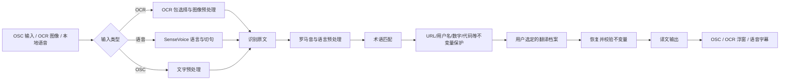

# VRCTranslate 多语言质量提升实施方案

## 1. 方案目的

本方案依据以下两份测试报告整理：

- `多语言翻译质量测试报告.md`：少量 VRChat 风格短句、人工判断、界面本地化和基础 OCR 验证。
- `多语言全链路质量与性能测试报告.md`：九语言 OCR、八语言本地语音、三个真实付费翻译档案、压力测试和端到端性能测试。

目标不是继续无条件增加语言和模型，而是先解决已经被测试证明的质量、实时性和数据保护问题，使当前功能达到可以稳定发布和持续回归的状态。

本文件只描述实施方案，不包含代码修改。

## 2. 两份报告的合并结论

| 模块 | 已确认事实 | 产品决策 |
|---|---|---|
| 界面语言 | 九套语言文件结构一致，多 DPI 测试通过，但部分内容仍以机器翻译为基础 | 保留九种界面语言，增加母语审校流程，不继续盲目扩充界面语言 |
| OCR | 24/32px 下九种文字基本可用；16px 简中和韩文错误率明显升高 | 保留现有六个 OCR 包，优先优化小字、边缘和调度，不更换整套 OCR 引擎 |
| OCR 性能 | 暖启动 P50 约 0.56～0.92 秒，无法真正按 250ms 完成每一帧 | 改为单任务、只处理最新帧；界面周期代表检查频率，不代表每帧都识别 |
| 本地语音 | SenseVoice 对中、英、日、韩速度和质量均明显优于 Whisper | 正式版只保留 SenseVoice 的中英日韩能力 |
| Whisper base | 体积较小，但多数语言识别质量不足 | 不接入正式软件，不作为 SenseVoice 替代品 |
| Whisper small | 西语干净语音尚可，法德俄噪声下明显恶化，单句 P50 约 2.5 秒 | 暂不进入正式功能；西语仅保留后续实验资格 |
| 翻译接口 | 腾讯和阿里均可稳定调用；不同方向没有统一赢家 | 继续由用户选择档案，只显示方向建议，不静默切换付费服务 |
| Google 免费 | 连续超时并触发熔断 | 标记为实验性、无 SLA，不允许成为默认路线 |
| VRChat 文本 | URL、用户名、数字、OSC 地址会被部分接口破坏 | 通用不变量保护列为最高优先级，且必须独立于术语库 |
| 端到端 | OCR→翻译 P50 约 0.9～1.4 秒；SenseVoice→翻译约 0.4～0.53 秒 | OCR 重点优化识别耗时；语音重点优化切句、排队和译文更新 |

## 3. 如何处理两份报告中看似矛盾的结论

### 3.1 腾讯在自动指标中领先，但短句人工体验仍可能较差

FLORES 自动指标说明腾讯在多个“其他语言→简中”方向上整体表现较好；旧报告则发现德语、西班牙语等个别 VRChat 短句存在问候、人称和语义缺失。

这两项结果并不冲突：

- FLORES 用于筛选通用语料上的相对质量。
- VRChat 短句用于发现口语、人称、敬语、邀请和专有名词问题。
- 一个服务只有同时通过通用测试和 VRChat 场景测试，才能获得“推荐”标记。

因此，不能把 FLORES 的最高 chrF 直接变成软件默认路线，也不能用一个短句否定整个服务。

### 3.2 DeepL 暂时不能列为已验证推荐

旧报告提出法语、德语、西班牙语可优先考虑 DeepL，但本轮没有 DeepL 凭据和真实结果。这只能作为下一轮对比测试候选，不能在界面或文档中描述为已经证实质量更好。

### 3.3 Whisper 的最终结论以完整实测为准

旧报告计划以后测试 `base q5_0`；实际官方可用且完成测试的是 `base q5_1` 和 `small q5_1`。完整测试已经证明：

- `base q5_1` 不满足正式接入的质量要求。
- `small q5_1` 不满足实时字幕延迟要求。
- 当前不增加 Whisper 模型、运行库、下载入口或正式语言能力声明。

## 4. 目标处理流程

关键约束：

1. OCR 包、识别出的自然语言、翻译源语言是三个不同概念，不能绑定成一个字段。
2. 术语替换和通用不变量保护是两个不同阶段。
3. 翻译失败时保留原文，不允许把缺失 URL、用户名或数字的译文继续发送。
4. 任何质量推荐只在用户已经配置的档案中生效，不自动创建付费配置。

## 5. 分阶段实施计划

### 阶段 A：正确性修复（P0）

#### A1. 通用不变量保护

在术语处理之后、发送翻译请求之前，对下列内容生成临时占位符：

- `http://`、`https://` URL 和查询参数。
- 邮箱、`@用户名`、VRChat 用户名和房间标识。
- OSC 地址、文件路径、代码片段、版本号。
- 整数、小数、时间、百分比和带单位数值。
- 已确认必须原样保留的 `VRChat`、`OSC` 等标识。

翻译完成后恢复原值，并逐项校验数量、顺序和内容。校验失败时：

- 不发送损坏译文。
- 显示“译文未通过内容保护校验”。
- 允许回退到原文或由用户重新请求。

验收标准：所有测试档案的不变量最终保留率达到 100%，而不是依赖服务商本身保留占位符的能力。

#### A2. 修正翻译档案语义

- “阿里通用”和“阿里专业”必须保存并调用各自真实接口类型。
- 重新加载软件后，档案类型、区域、语言能力和当前路线保持一致。
- 档案验证必须包含一次最小真实请求，不能只判断字段是否填写。
- 验证结果区分凭据错误、配额不足、语言不支持、网络超时和服务端错误。

验收标准：保存“阿里专业”后重新打开仍为专业版，并能从实际请求或模拟响应中确认调用类型。

#### A3. OCR 包与翻译语言解耦

示例：

- `latin` 是 OCR 识别包，不是法语、德语或西班牙语。
- `cyrillic` 是文字识别包，不等于固定俄语翻译方向。
- OCR 源语言设为自动时，由翻译服务自行检测；不支持自动检测的档案必须要求用户选择自然语言。

验收标准：选择拉丁 OCR 包后，仍可独立选择英文、法文、德文和西文翻译源语言。

#### A4. Google 免费服务降级

- 保留为实验性服务，不删除现有用户档案。
- 新建档案和连接测试中明确显示“公共端点、无可用性保证”。
- 验证失败的档案不得成为 OSC、OCR 或语音默认路线。
- 运行期间连续失败后进入冷却，避免每条字幕重复等待完整超时。

验收标准：服务不可用时，单次故障不会阻塞后续 OCR 或语音任务队列。

### 阶段 B：OCR 质量与实时性（P1）

#### B1. 小字自适应预处理

- 估算候选文字高度。
- 小于约 22px 时，将识别输入放大 1.5～2 倍。
- 在选区四周增加 4～8px 识别内边距，再把结果坐标映射回原选区。
- 俄文只在置信度较低时尝试轻量锐化或对比度增强，避免所有帧重复识别。
- 嵌字坐标继续使用原始图像坐标，不能直接使用放大后的识别坐标。

目标值：

| 条件 | 当前主要问题 | 阶段目标 |
|---|---|---|
| 24/32px 九语言 | 最差约 3.34% CER | 所有语言 CER 不高于 3.5% |
| 16px 简中 | CER 约 20.1% | 降至 10% 以下 |
| 16px 韩文 | CER 约 88.4% | 降至 30% 以下；达不到时显示小字风险提示 |
| 俄文轻微模糊 | 相对敏感 | 相比当前压力样本至少降低 20% 相对错误率 |

这些是实施目标，不应在复测前写入用户文档作为已经实现的能力。

#### B2. OCR 调度

- 同一识别框最多保留一个正在执行的 OCR 任务。
- 新画面到达时覆盖尚未执行的旧画面，只处理最新帧。
- 拖动、缩放识别框和译文浮窗时暂停识别结果绘制。
- 翻译仍在执行时，不为已经过时的 OCR 结果继续创建新请求。
- 单次识别不进入周期队列，结果按现有规则保留到关闭、重新识别或区域变化。

验收标准：

- 待处理 OCR 帧数量始终不超过 1。
- 连续运行 10 分钟不产生持续增长的任务积压。
- OCR→翻译 P50 目标不高于 1.2 秒，P95 目标不高于 2 秒。
- 拖动浮窗时不因后台结果刷新产生明显卡顿。

#### B3. 模型生命周期

- OCR 包继续按需下载，不加入基础安装包。
- 切换 OCR 包时释放旧 ONNX Session。
- 记录模型切换前后 RSS，防止多个 OCR 模型长期同时驻留。
- 下载中断只保留可识别的临时文件，下一次启动先清理无效残留。

验收标准：多次切换模型后，内存不随切换次数持续线性增长。

### 阶段 C：翻译质量策略（P1）

#### C1. 建立 VRChat 场景审校集

每个正式翻译方向至少覆盖以下类别：

1. 问候和告别。
2. 邀请、拒绝和否定。
3. 单复数、人称和敬语。
4. Avatar、World、Instance、OSC 等 VRChat 术语。
5. 玩家用户名、URL、房间号和数字。
6. 口语、省略、感叹和常见网络表达。
7. 中短句与两句连续上下文。

第一轮建议每个方向 30 条核心样本。机器指标用于批量筛选，正式“推荐”必须再经过对应语言使用者或母语者抽检。

#### C2. 档案推荐规则

推荐只在用户已经配置并验证通过的档案中产生，采用以下顺序：

1. 请求成功率达到 99% 以上。
2. 经过软件保护后，不变量保留率达到 100%。
3. VRChat 人工样本没有严重语义、人称、否定和敬语错误。
4. 再比较同方向 chrF 和 VRChat 场景评分。
5. 质量接近时优先 P95 延迟更低的档案。

当前测试只能形成“候选建议”，不能形成强制默认值：

| 翻译方向 | 当前候选 | 处理方式 |
|---|---|---|
| 英/日/韩/法/德/西/俄 → 简中 | 腾讯 | 通用指标领先，仍需 VRChat 审校集确认 |
| 繁中 → 简中 | 阿里专业 | 作为候选建议 |
| 简中 → 繁中 | 阿里通用 | 作为候选建议 |
| 简中 → 英文 | 阿里通用 | 作为候选建议 |
| 简中 → 日文 | 阿里专业 | 作为候选建议 |
| 简中 → 韩文、法文、德文 | 腾讯 | 德文和法文必须重点复核问候、人称与敬语 |
| 简中 → 西文 | 阿里专业 | 重点复核语义遗漏 |
| 简中 → 俄文 | 阿里通用 | 作为候选建议 |

界面只显示“本机测试建议”和依据，不自动替用户更换档案。

#### C3. DeepL 和大模型后续测试

- DeepL 只有在用户提供有效档案后，才加入法、德、西方向的同样本对比。
- 大模型需要使用相同的 VRChat 场景集、低延迟参数和固定翻译提示词。
- 大模型还要单独统计首字延迟、完整响应延迟、格式外文本和不变量破坏率。
- 未完成真实测试前，不在用户界面标记“更准确”。

### 阶段 D：本地语音（P1/P2）

#### D1. 正式支持范围

| 语言 | 正式本地引擎 | 决策 |
|---|---|---|
| 简中 | SenseVoiceSmall INT8 | 保留 |
| 英文 | SenseVoiceSmall INT8 | 保留，噪声环境需提示 |
| 日文 | SenseVoiceSmall INT8 | 保留 |
| 韩文 | SenseVoiceSmall INT8 | 保留 |
| 法文、德文、俄文 | 无 | 暂不声明本地支持 |
| 西文 | 无 | Whisper small 仅保留研发结论，不加入正式包 |

SenseVoice 应真正接收用户选择的识别语言；自动识别可保留为默认选项，但明确指定语言时必须按指定语言执行。

#### D2. 实时字幕链路

- 使用 VAD/静音判断形成稳定句尾，只对完整句子发起翻译。
- 中间识别结果只更新原文预览，不连续调用翻译接口。
- 同一句话的旧翻译请求在新终稿出现时作废。
- 字幕自动滚动到最新条目，但用户主动查看历史内容时暂停自动滚动。
- 收起语音浮窗时暂停捕获和识别，避免后台继续占用资源。

验收标准：

- SenseVoice 中英日韩干净语音保持当前量级：中文/日文/韩文 CER 不高于 8%，英文 WER 不高于 12%。
- SenseVoice→翻译 P50 不高于 700ms，P95 不高于 900ms。
- 一句话只产生一次最终翻译请求；修订结果不造成请求风暴。

#### D3. 真实 VRChat 音频复测

FLEURS 属于清晰真人朗读，不能完全代表游戏中的多人重叠、背景音乐、虚拟麦克风和网络压缩。发布前增加手工场景测试：

- 单人清晰语音。
- 背景音乐和环境音。
- 两人短暂重叠。
- 快速说话、低音量和断句停顿。
- 英日、日韩等同一会话中的语言切换。

测试默认只记录指标和人工结论，不保留用户录音。

#### D4. Whisper 重新评估门槛

只有同时达到以下条件，才重新讨论接入 Whisper：

- 目标语言干净语音 WER/CER 不高于 15%。
- 10dB 噪声下错误率不高于 25%。
- 单句 P50 不高于 1 秒。
- 模型与运行库按需下载，不进入基础安装包。
- 能与 SenseVoice 依赖隔离，并可完整卸载。

当前 `base q5_1` 和 `small q5_1` 均未同时满足这些条件。

### 阶段 E：界面本地化和能力提示（P2）

- 保持九种界面语言，不新增第十种语言。
- 每套语言继续做键集合、占位符和布局自动检查。
- 由母语者优先审校导航、错误提示、OCR、语音和翻译档案页面。
- OCR 下拉框显示“文字识别包”，翻译源语言显示“自然语言”，避免将 `latin` 当成语言。
- 翻译和语音语言列表按当前档案的真实能力过滤。
- 对实验性、不稳定或未经过 VRChat 审校的服务显示简短状态标识。
- 未知界面语言继续回退到英文。

## 6. 回归测试体系

### 6.1 每次提交运行

- 单元、架构、Qt 界面和非付费集成测试。
- 九套本地化键、格式参数和最小窗口布局检查。
- URL、用户名、数字、术语占位和恢复测试。
- OCR 调度、取消、单次识别和浮窗拖动测试。
- 语音句尾、请求去重和字幕自动滚动测试。

### 6.2 功能版本发布前运行

- 九语言 OCR 固定回归集。
- SenseVoice 中英日韩固定语音集和噪声压力集。
- 每个已验证付费翻译档案的小型固定集。
- OSC、OCR、语音三条端到端链路。
- 100%、125%、150%、200% DPI 和最小窗口测试。

### 6.3 大版本或模型更换时运行

- 重新执行完整全链路基准。
- 更新原始 CSV/JSON、图表和 Markdown 报告。
- 对自动低分样本进行人工复核。
- 记录模型版本、哈希、运行库、CPU、内存和线程参数。

## 7. 发布门槛

| 范围 | 必须满足的条件 |
|---|---|
| 正确性修复 | 不变量保护 100%；翻译档案类型可正确持久化；Google 失败不会阻塞队列 |
| OCR 优化 | 24/32px 不退化；16px 简中和韩文达到阶段目标；任务无积压 |
| 本地语音 | 中英日韩质量不低于当前基线；无重复翻译请求；端到端延迟达标 |
| 翻译推荐 | 同时具有通用指标和 VRChat 场景结果；不静默切换付费服务 |
| 界面语言 | 九套键一致；核心页面经人工抽查；多 DPI 和最小窗口通过 |
| 隐私与存储 | 不保留截图和用户录音；新模型均按需下载；无无效模型残留 |

若只完成阶段 A，可作为修复版本发布。阶段 B～E 涉及行为、能力提示和质量策略变化，应合并为后续功能版本；具体 tag 应在代码完成并通过复测后确定。

## 8. 推荐执行顺序

1. 先完成通用不变量保护和阿里档案类型修复。
2. 完成 OCR 包、自然语言和翻译源语言解耦。
3. 实施 OCR 小字预处理、最新帧调度和模型释放。
4. 修正 SenseVoice 指定语言和句尾翻译流程。
5. 建立 VRChat 场景审校集，再生成档案方向建议。
6. 完善九语言文案和能力提示。
7. 运行固定回归、真实接口、VRChat 场景和多 DPI 测试。
8. 根据复测结果更新 README、使用说明和发布说明。

## 9. 本轮明确不实施的内容

- 不接入或打包 Whisper base/small。
- 不把 DeepL 描述为已验证最佳服务。
- 不把 Google 免费服务设为默认路线。
- 不自动更换用户的付费翻译档案。
- 不新增界面语言、OCR 包或本地语音语言。
- 不保存截图、用户语音或测试过程中的敏感配置。

## 10. 预期结果

完成本方案后，软件的提升重点不是“语言列表更长”，而是：

- OCR 在常见字幕尺寸下稳定，小字场景有明确优化和风险边界。
- 中英日韩本地语音保持低延迟，不被质量较差的 Whisper 方案拖累。
- 翻译档案推荐有真实依据，但最终选择权和费用控制仍属于用户。
- VRChat 用户名、URL、数字、OSC 地址和术语不会被翻译过程破坏。
- 每次版本发布都能用同一套数据判断质量是提升还是退化。

## 11. 实施结果（2026-07-21）

| 阶段 | 状态 | 已完成内容 |
|---|---|---|
| A：正确性 | 已完成 | 增加 URL、邮箱、用户名、OSC 地址、路径、版本号和数字保护；损坏时阻止输出；Google 免费连续失败冷却；OCR 包与自然语言分离；确认阿里通用/专业持久化和调用测试 |
| B：OCR | 已完成 | 小于约 22px 时进行 6px 边缘、2 倍放大重试并还原坐标；切换识别包释放旧会话；慢翻译期间只保留最新一帧 |
| C：翻译策略 | 软件部分已完成 | 根据 2026-07-21 本机报告显示只读方向候选和 Google 实验性提示；不会自动切换档案或产生额外请求 |
| D：本地语音 | 已完成 | SenseVoice 现在真正使用明确选择的中、英、日、韩语言；已有终稿翻译、重复终稿去重、最新请求策略和收起暂停继续保留 |
| E：界面与文档 | 已完成 | 九套语言增加一致的新文案；OCR 设置显示独立识别包；README 和使用说明同步更新 |

自动回归结果：单元与架构 175 项、Qt 界面 158 项、非人工网络集成 60 项全部通过；手工质量文件中的本地用例 1 项通过、5 项未显式启用的真实接口用例按设计跳过，共 394 项通过。Python 编译检查通过。

仍需发布前人工执行的验收不是代码缺口：

- 使用真实 VRChat 复杂背景复测 16px 简中和韩文，确认是否达到阶段目标。
- 使用实际游戏混音复测中英日韩 SenseVoice，测试多人重叠和背景音乐。
- 由对应语言使用者审校 VRChat 场景句，之后才能把“本机通用基准候选”升级为正式推荐。
- DeepL 和未配置的大模型只有在用户提供有效档案后才能进行真实对比，当前不会声称已经验证。
